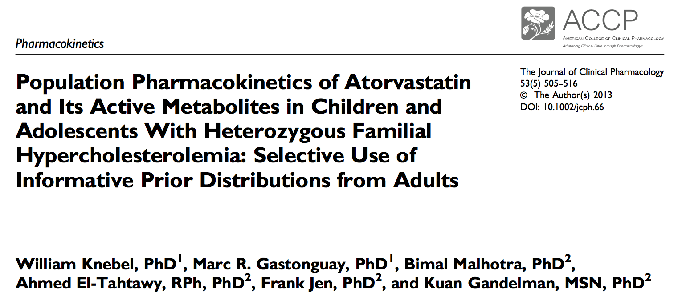
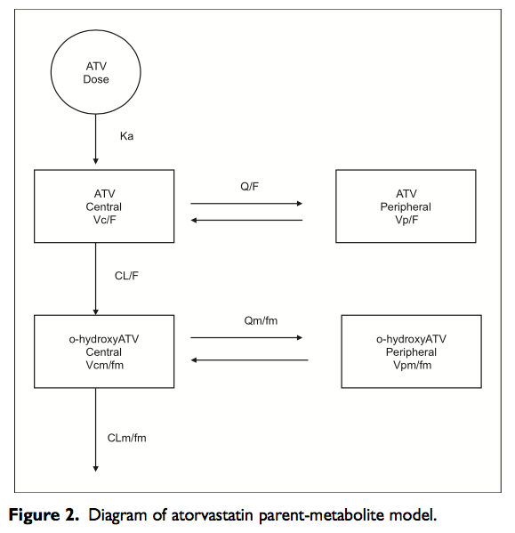

---
title: |
       | Introduction to Bayesian pharmacometric data analysis using NONMEM
       |
       | PopPK analysis using MCMC
author: "Metrum Research Group"
date: '`r format(Sys.Date(), "%B %d, %Y")`'
output:
  html_document:
    css: styles/styles.css
    highlight: pygments
    theme: flatly
---

# Population Parameter Estimation

## Estimation of pediatric atorvastatin PK given informative priors based on adults



---



---

<br>

## Specification of prior distributions for population means and inter-individual covariance


---


Let's revise the priors to be more consistent with current practice. Specifically,

*    Let's use weakly informative priors to guard against implausible values and help improve sampling performance.
    *    Update variance of CL/F, V2/F, and Q/F to 2.
    *    Add variance of $F_{chew}$ and SD to 1.
*    Let's use a LKJ prior for IIV correlation matrix and lognormal priors for diag(OMEGA).
    *    OLKJDF = 1 and OVARF=1.

## Setup R environment

```{r setup, results = 'hide'}

rm(list = ls())
gc()

modelName <- "atorv1"
scriptName <- paste(modelName, "Rmd", sep = ".")
fitModel <- FALSE

## Relative paths assuming the working directory is the script directory
## containing this script
scriptDir <- getwd()
projectDir <- dirname(scriptDir)
dataDir <- file.path(projectDir, "data")
modelDir <- file.path(projectDir, "model")
outDir <- file.path(modelDir, modelName)
figDir <- file.path(projectDir, "deliv", "figure", modelName)
tabDir <- file.path(projectDir, "deliv", "table", modelName)
invisible(dir.create(figDir, recursive = TRUE))
invisible(dir.create(tabDir, recursive = TRUE))

library(metrumrg)
suppressMessages(library(rstan))
suppressMessages(library(bayesplot))
suppressMessages(library(tidyverse))
library(gridExtra)
library(parallel)
library(knitr)
library(kableExtra)
library(qapply)
library(PKPDmisc)

knitr::opts_chunk$set(
  comment = '.', 
  fig.height = 5, 
  fig.width = 9,
  eval.after = 'fig.cap',
  message = FALSE,
  fig.path = file.path(figDir, paste(modelName, "_", sep = ""))
)

## Go back to default ggplot2 theme that was overridden by bayesplot
theme_set(theme_gray())

source(file.path(scriptDir, "tools", "stanTools2.R"))
source(file.path(scriptDir, "tools", "functions.R"))

rstan_options(auto_write = TRUE)
options(mc.cores = parallel::detectCores())

set.seed(11191951) 
set.seed(10271998) 

```

## The NONMEM model stub

```{r nonmemModel}

modelFile <- file.path(modelDir, paste(modelName, "stub.ctl", sep = ""))
modelText <- readLines(modelFile)
cat(modelText, sep = "\n")

```

## Assemble initial estimates, priors and table specs

```{r initsPriors}

## create initial estimates
geninit <- function(){
    paste(c(
    "; Initial values of THETA",
    "$THETA",
    paste(rnorm(1, log(1000), 0.5), "     ; TOTAL CL ATV = THETA(1)"),
    paste(rnorm(1, log(600), 0.5), "     ; V2 = THETA(2)"),
    paste(rnorm(1, log(130), 0.5), "   ; Q = THETA(3)"),
    paste(rnorm(1, log(1500), 0.5), "   ; V3 = THETA(4) "),
    paste(rnorm(1, log(1.2), 0.5), "   ; KA= THETA(5) "),
    paste(rnorm(1, log(1), 0.25), "   ; THETA(6) relative F1 CHEWABLE = THETA(5) "),
    paste(log(0.2), " ; THETA(7) - PRO RES ERROR"),
    "$OMEGA BLOCK(2) ;INITIAL values of OMEGAs",
    "0.1003           ; cl",
    ".06034  0.8477     ; v2",
    "$OMEGA 0 FIX",
    "$OMEGA 0 FIX",
    "$OMEGA 0 FIX",
    "$OMEGA 0 FIX",
    "$OMEGA 0 FIX",
    "$SIGMA  ;Initial value of SIGMA",
    "1 FIX; pro"),
    sep = "\n")
}

## Set parameters of the prior distribution
priors <- paste(c("$PRIOR NWPRI",
                  "$THETAP          ; Prior information of THETAS",
                  paste("(", 5.65, " FIX)      ;  THETA(1) TOTAL CL ATV"),
                  paste("(", 5.60, " FIX)      ;  THETA(2) V2"),
                  paste("(", 4.29, " FIX)      ;  THETA(3) Q"),
                  paste("(", 7.07, " FIX)      ;  THETA(4) V3"),
                  paste("(", -1.33, " FIX)      ; THETA(5) KA"),
                  paste("(", log(1), " FIX)      ; THETA(6) F1 chewable"),
                  paste("(", log(0.2), " FIX)      ; THETA(7) log(sigma)"),
                  "$THETAPV BLOCK(7)     ;  variances for priors on THETAS (var-cov)",
                  "2 FIX ; CL weakly informative",
                  "0.00 2  ; V2 weakly informative",
                  "0.00 0.00 2  ; Q weakly informative",
                  "0.00 0.00 0.00 .0156   ; V3 SE**2 informative",
                  "0.00 0.00 0.00 0.00 .00684    ; KA SE**2 informative",
                  "0.00 0.00 0.00 0.00 0.00 1    ; F1 chewable weakly informative",
                  "0.00 0.00 0.00 0.00 0.00 0.00 1    ; log(sigma) weakly informative",
## Parameters LKJ / lognormal prior; off-diagonal and OMEGAP ignored
                  "$OMEGAP BLOCK(2)   ; prior information for OMEGA",
                  ".1003   FIXED         ; cl",
                  ".06034    .8477       ; v2" ,
                  "$OMEGAPD (4.0, FIXED)     ; df for OMEGA prior"
## Parameters for inverse Wishart prior
##                  "$OMEGAP BLOCK(2)   ; prior information for OMEGA",
##                  ".1003   FIXED         ; cl",
##                  ".06034    .8477       ; v2" ,
##                  "$OMEGAPD (4.0, FIXED)     ; df for OMEGA prior"
),
sep = "\n")

## Table statements
tables <- paste(c("$TABLE ID EVID TIME DV IPRED CWRES CWRESI NPDE WT",
                  "NOPRINT ONEHEADER FILE=./.tab",
                  "$TABLE ID WT CL V2 Q KA V3 ETA1 ETA2 PER FORM",
                  "NOPRINT ONEHEADER FILE=./par.tab"),
                sep = "\n")
##tables <- paste(c("$TABLE ID EVID TIME DV IPRED CWRES CWRESI NPDE AGE WT",
##                  "NOPRINT ONEHEADER FILE=./.tab",
##                  "$TABLE ID WT CL V2 Q KA V3 ETA1 ETA2 PER FORM",
##                  "NOPRINT ONEHEADER FILE=./par.tab"),
##                sep = "\n")

```

## Run NONMEM

``` {r runNONMEM, results = 'hide'}

nChains <- 4
nPost <- 250 ## Number of post-burn-in samples per chain after thinning
nBurn <- 250 ## Number of burn-in samples per chain after thinning
nThin <- 1

seed = sample(10000, size = nChains)
if(fitModel){
  if(!file.exists(file.path(modelDir, modelName))) 
    dir.create(file.path(modelDir, modelName))
  runChains <- mclapply(1:nChains, runChain,
                      modelName = modelName, modelDir = modelDir, 
                      priors = priors, tables = tables,
                      nPost = nPost, nBurn = nBurn, nThin = nThin, 
                      seed = seed, print = 100,
                      ## LKJ prior for IIV correlation matrix with oarameter = OLKJDF
                      OLKJDF = 1, 
                      ## lognormal prior for IIV SDs
                      ## log(sqrt(Omega(i))) ~ Normal(log(sqrt(OmegaPrior(i))), 1/OVARF)
                      OVARF = 1, AUTO = 2, 
                      NUTS_DELTA = 0.8,
                      grid = TRUE,
                      method = "NUTS", 
##                      pe = "orte 16",
                      mode = "nonpara")
  # NONR(run = paste(modelName, ".", 1, sep = ""),
  #        command = "/opt/NONMEM/nm74gf/nmqual/autolog.pl",
  #        project = file.path(modelDir, modelName),
  #        grid = TRUE,
  #        wait = FALSE,
  #        diag = FALSE,
  #        fdata = FALSE,
  #        purge = FALSE,
  #        checkrunno = TRUE)
  
  }

```

## read in data file
```{r getData}

dataFile <- "atorvWrkShop.csv"
nmData <- read.csv(file.path(dataDir, dataFile), as.is = TRUE)

```

## Get population parameters

```{r getPopParam}

chains <- 1:nChains
##chains <- c(1, 4)

nChains2 <- length(chains)

## Read in posterior distributions by chain and add a column called chain
popParameters <- map(chains, function(thisChain){
  param <- data.table::fread(file.path(modelDir, modelName, paste(modelName, ".", thisChain, sep = ""), 
                                       "par.txt"), data.table = FALSE) 
  names(param) <- c("iteration", "OMEGA11", "OMEGA21", "OMEGA22",
                    "THETA1", "THETA2", "THETA3", "THETA4", "THETA5", 
                    "THETA6", "THETA7")
  param %>% mutate(chain = thisChain)
}) %>% bind_rows %>%
  mutate(sample = 1:n())

## Calculate more interpretable paraneters
popParameters2 <- popParameters %>%
  mutate(CLHat = exp(THETA1),
         V2Hat = exp(THETA2),
         QHat = exp(THETA3),
         V3Hat = exp(THETA4),
##         k10 = CLHat / V2Hat,
##         k12 = QHat / V2Hat,
##         k21 = QHat / V3Hat,
##         lambda = ((k10 + k12 + k21) - 
##           sqrt((k10 + k12 + k21)^2 - 4 * k10 * k21)) / 2,
##         KAHat = exp(THETA4) + lambda,
##         KAHat = exp(THETA4 + lambda),
         KAHat = exp(THETA5),
         F1Chewable = exp(THETA6),
         sigma1 = exp(THETA7)) %>%
  select(starts_with("OMEGA"),
         CLHat, V2Hat, QHat, V3Hat, KAHat, F1Chewable, sigma1, chain, iteration, sample)

## Convert to 3-D array with dims = {iterations, chains, parameters}. 
popParArray <- array(double(nPost * nChains2 * (ncol(popParameters2) - 3)), 
                     dim = c(nPost, nChains2, ncol(popParameters2) - 3), 
                     dimnames =  list(NULL, NULL, setdiff(names(popParameters2), c("chain", "iteration", "sample"))))
for(iChain in 1:nChains2){
  popParArray[,iChain,] <- popParameters2 %>%
    filter(chain == chains[iChain],
           iteration > 0) %>%
    select(-chain, -iteration, -sample) %>%
    as.matrix
}

```

## Get individual parameters

```{r getIndParam}

indParameters = map(chains, function(thisChain){
  files <- list.files(file.path(modelDir, modelName, paste(modelName, ".", thisChain, sep = "")))
  iparFiles <- files[grepl("^ipar", files)]
  param <- map(iparFiles, function(thisFile){
    data.table::fread(file.path(modelDir, modelName, paste(modelName, ".", thisChain, sep = ""), 
                                thisFile), data.table = FALSE)
  }) %>% 
    bind_rows 
  names(param) <- c("iteration", "ID", "ETA1", "ETA2")
  param %>% mutate(chain = thisChain)
}) %>% bind_rows %>%
  arrange(chain, iteration, ID) %>%
  left_join(popParameters)

```

## MCMC diagnostics and posterior distributions of parameters

``` {r parameters, fig.cap = caption}

options(bayesplot.base_size = 12,
        bayesplot.base_family = "sans")
color_scheme_set(scheme = "brightblue")
myTheme <- theme(text = element_text(size = 12), 
                 axis.text = element_text(size = 12))

plot_mcmcHistory <- mcmcHistory(popParArray,
                                 nParPerPage = 5, myTheme = myTheme)
plot_mcmcDensityByChain <- mcmcDensity(popParArray, 
                                        nParPerPage = 16, byChain = TRUE, 
                                        myTheme = theme(text = element_text(size = 12), 
                                                        axis.text = element_text(size = 10)))
plot_mcmcDensity <- mcmcDensity(popParArray, nParPerPage = 16, 
                                 myTheme = theme(text = element_text(size = 12), 
                                                 axis.text = element_text(size = 10)))

plot_mcmcHistory
plot_mcmcDensityByChain
plot_mcmcDensity
mcmc_pairs(popParArray[,,!grepl("^OMEGA", dimnames(popParArray)[[3]])])
mcmc_pairs(popParArray[,,grepl("^OMEGA", dimnames(popParArray)[[3]])])

caption <- paste("Pediatric atorvastatin PK example:",
      c(rep("MCMC trace plots.", length(plot_mcmcHistory)),
        rep("Univariate marginal densities by chain.",
            length(plot_mcmcDensityByChain)),
        rep("Univariate marginal densities.",
            length(plot_mcmcDensityByChain)),
        rep("Bivariate marginal densities.", 2)))

ptable <- monitor(popParArray, 
                  warmup = 0, print = FALSE) %>% 
  as.matrix %>%
  formatC(3) %>%
  as.data.frame
write.csv(ptable, file = file.path(tabDir, paste(modelName, 
                                                 "ParameterTable.csv", sep = "")))

ptable %>% 
  rename(SEmean = se_mean, SD = sd, pct2.5 = "2.5%", pct25 = "25%", median = "50%",
         pct75 = "75%", pct97.5 = "97.5%", Neff = "n_eff") %>%
  mutate(parameter = rownames(.), "95% CI" = paste("(", pct2.5, ", ", pct97.5, ")", 
                                                   sep = "")) %>%
  select(parameter, mean, SD, median, "95% CI", Neff, Rhat) %>%
  kable(caption = "Summary of model parameter estimates.") %>%
  kable_styling(bootstrap_options = "striped", full_width = F)

```

## Construct design data frame

```{r design}

## For now just use the NONMEM data set

design <- nmData %>%
  filter(C == ".")


```

## mrgsolve model code for posterior predictions

```{r model code}

library(mrgsolve)

indCode =
  '
$PARAM 
THETA1 = 5.65
THETA2 = 5.60
THETA3 = 4.29
THETA4 = -1.33
THETA5 = 7.07
THETA6 = 1
THETA7 = -3.2189
WT = 70
FORM = 1
ETA1 = 0
ETA2 = 0

$MAIN

double VWT = log(WT/70); 
double CL = exp(THETA1 + (VWT * 0.75) + ETA1 + ETA(1)); 
double V2 = exp(THETA2 + VWT + ETA2 + ETA(2));
double Q = exp(THETA3 + (VWT * 0.75));
double V3 = exp(THETA5 + VWT);

//double T1 = CL/V2;
//double T23 = Q/V2;
//double T32 = Q/V3;
//double L2 = ((T1+T23+T32)-sqrt(pow(T1+T23+T32, 2)-4*T1*T32))/2;

double KA = exp(THETA4);
F_GUT = 1.0;             // TABLET AS REFERENCE
if(FORM == 2) F_GUT = exp(THETA6);  // CHEWABLE F1

$PKMODEL cmt = "GUT CENT PERIPH", depot = TRUE

$SIGMA 1

$OMEGA @block
0 0 0

$TABLE
double cPredHat = 1000 * (CENT / V2);
double cPred = cPredHat * (1 + exp(THETA7) * EPS(1));

$CAPTURE cPred
'

## Compile model
atvMod <- mcode("ATVmodel", indCode)

if(FALSE){
  ## Test runs
  out <- atvMod %>%
    data_set(design) %>%
    carry_out(DOSE) %>%
    mrgsim
  
  plot(out, cPred ~ TIME | factor(DOSE), scales = "same")
  
  out <- atvMod %>%
    data_set(design) %>%
    param(popParameters2[1,] %>%
            rename(CL = CLHat,
                   V2 = V2Hat,
                   Q = QHat,
                   V3 = V3Hat,
                   KA = KAHat,
                   F1 = F1Chewable)) %>%
    carry_out(DOSE) %>%
    mrgsim
  
  plot(out, cPred ~ TIME | factor(DOSE), scales = "same")
}

```

## Individual predictions

```{r indSim}

samples <- unique(indParameters$sample)
samples <- 1:8
indSim1 <- mclapply(samples,
                    function(thisSample){
                      atvMod %>%
                        data_set(design) %>%
                        idata_set(indParameters %>% 
                                filter(sample == thisSample)) %>%
                        carry_out(sample, ID, TIME, DV, EVID, DOSE, FORM) %>%
                        mrgsim %>%
                        as.tbl
                    }) %>%
  bind_rows

```

## Population predictions

```{r popSim}

samples <- unique(popParameters$sample)
popSim1 <- mclapply(samples,
                    function(thisSample){
                      atvMod %>%
                        data_set(design) %>%
                        param(popParameters %>% 
                                filter(sample == thisSample)) %>%
                        omat(matrix(with(popParameters %>% 
                                filter(sample == thisSample), 
                                c(OMEGA11, OMEGA21, OMEGA21, OMEGA22)), ncol = 2)) %>%
                        carry_out(sample, ID, TIME, DV, EVID, DOSE, FORM) %>%
                        mrgsim %>%
                        as.tbl
                    }) %>%
  bind_rows

```

## Posterior predictive distributions

``` {r PPC, results = 'asis'}

## Combined plots

indPred <- indSim1 %>%
  group_by(ID, TIME, EVID, DOSE, FORM) %>%
  summarize(lbInd = quantile(cPred, probs = 0.05, na.rm = TRUE),
            medianInd = quantile(cPred, probs = 0.5, na.rm = TRUE),
            ubInd = quantile(cPred, probs = 0.95, na.rm = TRUE))

popPred <- popSim1 %>%
  group_by(ID, TIME, EVID, DOSE, FORM) %>%
  summarize(lbPop = quantile(cPred, probs = 0.05, na.rm = TRUE),
            medianPop = quantile(cPred, probs = 0.5, na.rm = TRUE),
            ubPop = quantile(cPred, probs = 0.95, na.rm = TRUE))

predAll <- indPred %>%
  left_join(popPred) %>%
  left_join(design) %>%
  mutate(DV = suppressWarnings(as.numeric(DV)))

forms <- sort(unique(predAll$FORM))
plot_PPCPK <- lapply(forms,
                     function(thisForm){
  p1 <- ggplot(predAll %>% filter(FORM == thisForm), 
               aes(x = TIME, y = DV))
  p1 <- p1 + 
    geom_line(aes(x = TIME, y = medianPop, 
                 color = "population")) +
    geom_ribbon(aes(ymin = lbPop, ymax = ubPop, 
                   fill = "population"), 
               alpha = 0.25) +
    geom_line(aes(x = TIME, y = medianInd, 
                  color = "individual")) +
    geom_ribbon(aes(ymin = lbInd, ymax = ubInd, 
                    fill = "individual"), 
                alpha = 0.25) +
    scale_color_brewer(name  ="prediction",
                       breaks=c("individual", "population"),
                       palette = "Set1") +
    scale_fill_brewer(name  ="prediction",
                      breaks=c("individual", "population"),
                      palette = "Set1")
  p1 + geom_point() +
    labs(title = paste("formulation =", c("tablet", "chewable")[thisForm]),
         x = "time (h)",
         y = "atorvastatin plasma concentration (nM)") +
    theme(text = element_text(size = 12),
          axis.text = element_text(size = 12),
##          legend.position = c(0.8, 0.25),
          strip.text = element_text(size = 8)) +
    facet_wrap(~ ID, scales = "free_y")
})
plot_PPCPK

```

```{r theEnd}

sessionInfo()

```
