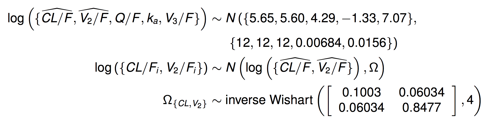

---
title: |
       | Introduction to Bayesian pharmacometric data analysis using NONMEM
       |
       | Hands-on 2: MAP Bayes example
author: "Metrum Research Group, LLC"
date: '`r format(Sys.Date(), "%B %d, %Y")`'
output:
  html_document:
    css: styles/styles.css
    highlight: pygments
    theme: flatly
---

# Population Parameter Estimation

## Estimation of pediatric atorvastatin PK given informative priors based on adults


---


---

<br>

## Specification of prior distributions for population means and inter-individual covariance


---

## Setup R environment

```{r setup, results = 'hide'}

rm(list = ls())
gc()

modelName <- "atorvMAPBayes"
scriptName <- paste('atorvMAPBayes', "Rmd", sep = ".")
fitModel <- FALSE

## Relative paths assuming the working directory is the script directory
## containing this script
scriptDir <- getwd()
projectDir <- dirname(scriptDir)
dataDir <- file.path(projectDir, "data")
modelDir <- file.path(projectDir, "model")
outDir <- file.path(modelDir, modelName)
figDir <- file.path(projectDir, "deliv", "figure", modelName)
tabDir <- file.path(projectDir, "deliv", "table", modelName)
invisible(dir.create(figDir, recursive = TRUE))
invisible(dir.create(tabDir, recursive = TRUE))


library(metrumrg)
suppressMessages(library(tidyverse))
library(gridExtra)
library(parallel)
library(knitr)
library(kableExtra)
library(qapply)
library(PKPDmisc)

knitr::opts_chunk$set(
  comment = '.', 
  fig.height = 5, 
  fig.width = 9,
  eval.after = 'fig.cap',
  message = FALSE,
  fig.path = file.path(figDir, paste(modelName, "_", sep = ""))
)

## Go back to default ggplot2 theme that was overridden by bayesplot
theme_set(theme_gray())

source(file.path(scriptDir, "tools", "stanTools2.R"))
source(file.path(scriptDir, "tools", "functions.R"))

options(mc.cores = parallel::detectCores())

RNGkind("L'Ecuyer-CMRG")
set.seed(11191951) 
set.seed(10271998) 

```

## The NONMEM model stub

```{r nonmemModel}

modelFile <- file.path(modelDir, paste(modelName, "stub.ctl", sep = ""))
modelText <- readLines(modelFile)
cat(modelText, sep = "\n")

```

## Assemble initial estimates, priors and table specs

```{r initsPriors}

seed = 06222015

## create initial estimates
geninit <- function(seed){
    paste(c(
    "; Initial values of THETA",
    "$THETA",
    paste("(1,", rnorm.trunc(1, 6.0,1.0,lower=1,upper=10), ", 10)    ; TOTAL CL ATV = THETA(1)"),
    paste("(1,",rnorm.trunc(1, 4.0, 1.0,lower=1,upper=10), " , 10)    ; V2 = THETA(2)"),
    paste("(1,",rnorm.trunc(1, 5.0,1.0,lower=1,upper=10), "  , 10) ; Q = THETA(3)"),
    paste("(-2,",rnorm.trunc(1, -0.5,0.5,lower=-2,upper=0), "  , 0),   ; KA= THETA(4) "),
    paste("(1,",rnorm.trunc(1, 7.4, 1.0,lower=1,upper=10), " , 10)  ; V3 = THETA(5) "),
    "(1 FIX) ; THETA(6) RELATIVE F1 TABLET",
    "(0,1) ; THETA(7) relative F1 CHEWABLE",
    "(-3.2189) ; THETA(8) - PRO RES ERROR",   # equiv. to initial 0.04 on a linear scale
    "$OMEGA BLOCK(2) ;INITIAL values of OMEGAs",
    "0.1           ; cl",
    "0.03  0.2     ; v2",
    "$SIGMA  ;Initial value of SIGMA",
    "1 FIX; pro"),
    sep = "\n")
}

## Set parameters of the prior distribution
priors <- paste(c("$PRIOR NWPRI",
                  "$THETAP          ; Prior information of THETAS",
                  "(5.65 FIX)      ;  THETA(1) TOTAL CL ATV",
                  "(5.60 FIX)      ;  THETA(2) V2",
                  "(4.29 FIX)      ;  THETA(3) Q",
                  "(-1.33 FIX)      ; THETA(4) KA",
                  "(7.07 FIX)      ;  THETA(5) V3",
                  "$THETAPV BLOCK(5)     ;  variances for priors on THETAS (var-cov)",
                  "12 FIX ; CL uninformative",
                  "0.00 12  ; V2 SE**2 FROM CADUET",
                  "0.00 0.00 12  ; Q SE**2 FROM CADUET",
                  "0.00 0.00 0.00 .00684   ; KA SE**2 FROM CADUET range of ka based on dose",
                  "0.00 0.00 0.00 0.00 .0156    ; SE**2 of V2 FROM CADUET since no V3 estimate",
                  "$OMEGAP BLOCK(2)   ; prior information for OMEGA - FROM CADUET",
                  ".1003   FIXED         ; cl",
                  ".06034    .8477       ; v2",
                  "$OMEGAPD (4.0, FIXED)     ; df for OMEGA prior"
),
sep = "\n")

## Table statements
tables <- paste(c("$TABLE ID EVID TIME DV IPRED CWRES CWRESI NPDE WT",
                  "NOPRINT ONEHEADER FILE=./.tab",
                  "$TABLE ID WT CL V2 Q KA V3 ETA1 ETA2 PER FORM AUC",
                  "NOPRINT ONEHEADER FILE=./par.tab"),
                sep = "\n")

```

## Run NONMEM

``` {r runStan, results = 'hide', eval=FALSE}

if(fitModel){
  set.seed(10301990)
  
  if(!file.exists(file.path(modelDir, modelName))) 
    dir.create(file.path(modelDir, modelName))
  runOpt(modelName, modelDir, priors, tables, method = 1, mode = "nonpara", AUTO=0, Lapl=TRUE, OLKJDF = 0, OVARF = 1)
}

```

```{r NONMEMResults}

nmLstFile <- file.path(modelDir, modelName, modelName, paste(modelName,  ".lst", sep = ""))
nmLstText <- readLines(nmLstFile)
cat(nmLstText, sep = "\n")


```


```{r MAPplots}

tab = PKPDmisc::read_nonmem(path = file.path(modelDir, modelName, modelName, 
                                             paste(modelName, ".tab", sep = ""))) %>%
  filter(EVID==0)

p1 <- ggplot(tab, aes(x = IPRED, y = DV)) +
  geom_point() + geom_smooth() + geom_abline(slope = 1)
 
p1

p2 <- ggplot(tab, aes(x = PRED, y = DV)) +
  geom_point() + geom_smooth() + geom_abline(slope = 1)
 
p2

p3 <- ggplot(tab, aes(x = PRED, y = NPDE)) +
  geom_point() + geom_smooth() + geom_hline(yintercept = 0)
 
p3

p4 <- ggplot(tab, aes(x = TIME, y = NPDE)) +
  geom_point() + geom_smooth() + geom_hline(yintercept = 0)
 
p4


```


```{r theEnd}

sessionInfo()

```
